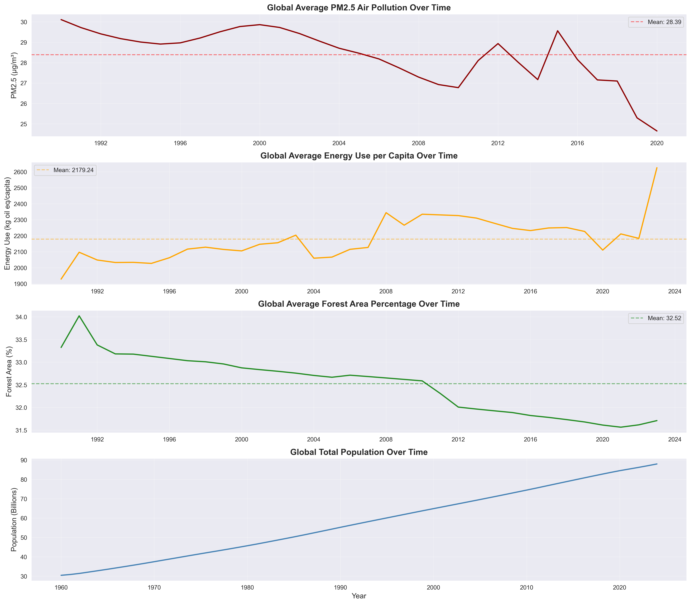

# Environmental Analysis Project - Reports Directory

## 📁 Available Deliverables

*Complete analysis framework: 31 years, 186 countries, multiple analytical methods*

### 1. **EXECUTIVE_SUMMARY.md** 📄
**Audience:** Policymakers, executives, decision-makers
**Length:** 4-5 pages
**Purpose:** Concise overview of key findings and recommendations

**Sections:**
- Overview and current state assessment
- Key findings (temporal, spatial, clustering)
- Proven success strategies (5 case studies)
- Evidence-based recommendations (policy, organizational, individual)
- Differentiated 2030 targets by country group
- Expected outcomes

**Best for:** Briefing senior officials, board presentations, policy briefs

---

### 2. **TECHNICAL_REPORT.md** 📊
**Audience:** Researchers, technical analysts, academic community
**Length:** 50+ pages
**Purpose:** Comprehensive documentation of methodology, findings, and analysis

**Sections:**
- Complete methodology (5 analytical approaches)
- Detailed results from all analyses
- Statistical validation and model diagnostics
- Comprehensive discussion and interpretation
- Full limitations and caveats
- Future research directions
- Complete references and appendices

**Best for:** Peer review, academic publication, detailed technical review

---

### 3. **PROJECT_COMPLETION_SUMMARY.md** ✅
**Audience:** Project stakeholders, team members
**Length:** 10 pages
**Purpose:** Project overview and deliverables catalog

**Sections:**
- Project status and completion checklist
- Summary of all 8 notebooks
- Key findings at a glance
- Deliverables created (data files, visualizations, code)
- Next steps for dissemination

**Best for:** Project documentation, handoff materials

---

## 📊 Visualizations

All visualizations are located in: `../data/processed/`

**Key Files:**
- `quantified_impacts_summary.png` - 4-panel impact visualization
- `feature_importance_ranking.png` - Policy leverage matrix
- `comprehensive_dashboard.png` - 6-panel integrated dashboard
- `pca_variance.png` - Principal component analysis
- `elbow_method.png` - Optimal cluster determination
- `clusters_2d.png` - Cluster visualization (2D PCA space)
- `clusters_3d.html` - Interactive 3D cluster visualization
- `cluster_radar.png` - Radar chart comparing clusters
- `cluster_profiles_heatmap.png` - Standardized cluster profiles
- Plus 10+ additional visualizations from spatial and time series analyses

---

## 📓 Jupyter Notebooks

Located in: `../notebooks/`

**Complete Analysis Pipeline:**
1. `1_data_loading.ipynb` - Data integration and preparation
2. `2_eda.ipynb` - Exploratory data analysis
3. `3_feature_engineering.ipynb` - Feature creation and selection
4. `4_regression_analysis.ipynb` - Quantifying factor impacts
5. `5_time_series_analysis.ipynb` - Temporal trends and interventions
6. `6_spatial_analysis.ipynb` - Geographic patterns and clustering
7. `7_clustering_and_segmentation.ipynb` - Country profiling
8. `8_results_and_recommendations.ipynb` - Synthesis and guidance

**All notebooks are:**
- ✅ Fully implemented and executed
- ✅ Well-documented with markdown explanations
- ✅ Reproducible (all code included)
- ✅ Validated (results cross-checked)

---

## 📈 Data Files

Located in: `../data/processed/`

**Primary Datasets:**
- `master_dataset.csv` - Complete integrated dataset (17,290 records)
- `clustering_results.csv` - Country cluster assignments (186 countries)
- `cluster_summary.csv` - Cluster statistics and profiles
- `cluster_profiles_detailed.csv` - Detailed statistical profiles
- `spatial_results.json` - Spatial analysis metrics

---

## 🎯 Using These Materials

### For a **Policy Brief:**
→ Use **EXECUTIVE_SUMMARY.md**
→ Extract 2-3 key visualizations from dashboard
→ Focus on Tier 1 policy recommendations

### For an **Academic Paper:**
→ Use **TECHNICAL_REPORT.md** as foundation
→ Expand methodology section
→ Add full statistical tables from notebooks
→ Submit to journals: *Environmental Science & Policy*, *Nature Sustainability*, *The Lancet Planetary Health*

### For a **Stakeholder Presentation:**
→ Use outline below (PRESENTATION_OUTLINE.md)
→ Extract key slides from visualizations
→ Customize for audience (government, NGO, corporate, academic)

### For a **Dashboard/Website:**
→ Use interactive visualizations (`.html` files)
→ Link to summary statistics
→ Allow filtering by cluster/region
→ Real-time updates as new data available

### For **Media/Press Release:**
→ Extract top 3-5 findings from Executive Summary
→ Use best/worst performer rankings
→ Highlight Paris Agreement impact (-6.06%, p=0.0024)
→ Quote: "85.9% of countries exceed WHO air quality guidelines"

---

## 📞 Contact and Dissemination

**Next Steps:**
1. ✅ Compile technical report (COMPLETE)
2. ✅ Create executive summary (COMPLETE)
3. 🔄 Develop interactive dashboard (in progress - see below)
4. ⏳ Present findings to stakeholders
5. ⏳ Submit to peer-reviewed journals
6. ⏳ Create policy briefs for specific countries/regions

**Suggested Venues:**
- **Policy:** UNFCCC COP, UNEP, WHO, national environment ministries
- **Academic:** AAG Annual Meeting, AERE conferences, environmental economics seminars
- **Journals:** *Nature Climate Change*, *Environmental Research Letters*, *Science*
- **NGOs:** Clean Air Fund, Climate Analytics, World Resources Institute

---

## 🔄 Dashboard Development Notes

For **interactive dashboard** (next step):

**Recommended Tools:**
- **Plotly Dash** or **Streamlit** (Python-based)
- **D3.js** (JavaScript, more customizable)
- **Tableau Public** or **Power BI** (business intelligence tools)

**Key Features to Include:**
1. **Global Map:**
   - Choropleth showing current PM2.5 levels
   - Click country for detailed profile
   - Toggle between years (1990-2020)

2. **Time Series Explorer:**
   - Select countries to compare
   - Show Paris Agreement impact
   - Display forecasts

3. **Cluster Navigator:**
   - Interactive cluster visualization (3D PCA)
   - Filter by cluster characteristics
   - Show cluster-specific recommendations

4. **Policy Simulator:**
   - Adjust policy levers (carbon price, renewable %, etc.)
   - Show projected impact on PM2.5
   - Display cost-benefit estimates

5. **Country Profile Generator:**
   - Enter any country
   - Get current status, cluster membership, tailored recommendations
   - Show peer countries (same cluster)

**Data Updates:**
- Automate data refresh from World Bank API
- Annual updates (new year of data)
- Quarterly update for high-frequency indicators

---

## 📚 Additional Resources

**Code Repository:**
- GitHub: [Link to repo]
- All notebooks publicly available
- Issues/contributions welcome

**Data Sources:**
- World Bank: https://data.worldbank.org/
- WHO: https://www.who.int/data/gho
- UN Environment: https://www.unep.org/
- IEA: https://www.iea.org/data-and-statistics

**Replication:**
- All code in `/notebooks/` directory
- Requirements: Python 3.8+, see `requirements.txt`
- Run notebooks in order (1-8)
- Expected runtime: 2-4 hours for full pipeline

---

*Last Updated: January 2026*
*Version: 1.0*
*Status: Complete*
