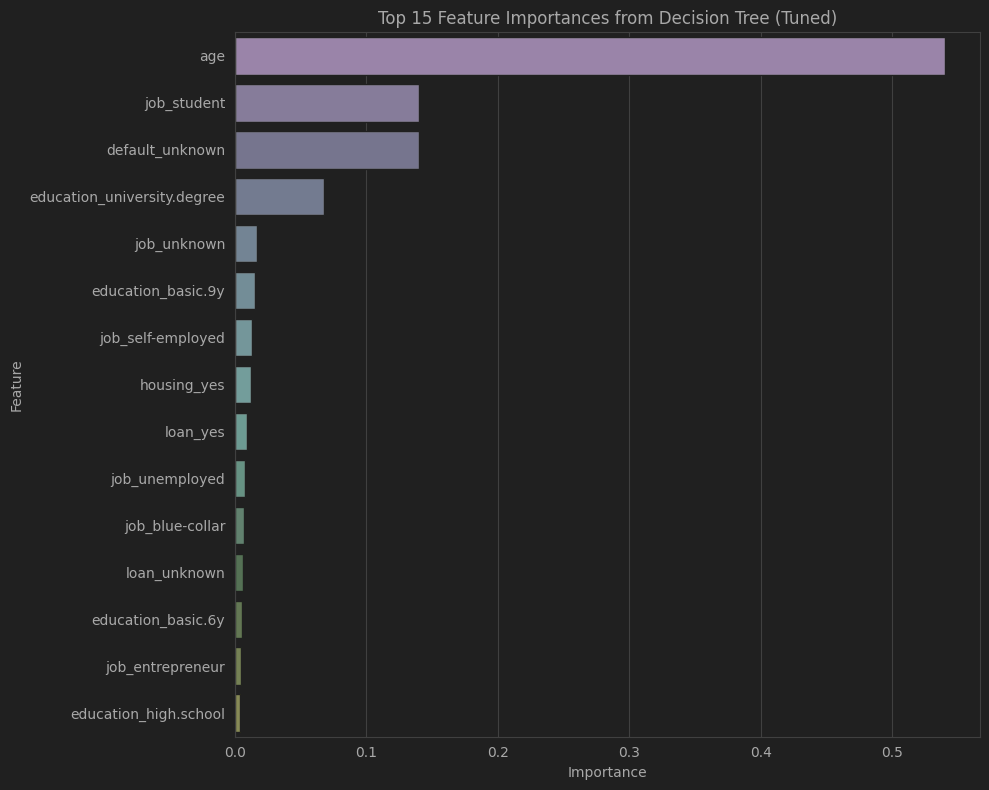
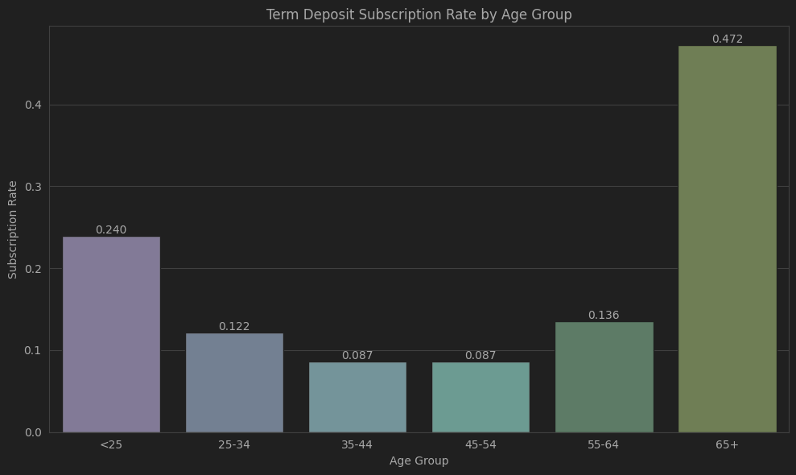

## Conclusions

The business objective of this project is to predict how and what bank client will subscribe to a term deposit.

It used real-world data from a Portugese banking institution, a collection of the results of multiple marketing campaigns. Through Data Mining (DM) and iterative applications of the CRISP-DM methodology, several classification models were developed and refined — including K-Nearest Neighbors, Logistic Regression, Decision Trees, and Support Vector Machines, baseline and tuned. The models were evaluated using metrics such as accuracy, precision, recall, F1-score, training time, and ROC AUC to determine the best-performing model.

The best model, Decision Tree model, that has highest cross-validation ROC AUC score among all models trained shows important features and how that banks can use to boost campaigns.

For example, it shows the highest propensity to subscribe is among older clients (65+). Also students have a significantly higher term deposit subscription rate of 31.43%.

More work can be done to analyse other features that have high importance to win more clients.

Further optimization of this model or exploration of ensemble methods built upon tree-based models (e.g., Random Forest, Gradient Boosting) could potentially lead to better performance.

The 0.0 Precision, Recall, and F1-Score for tuned Logistic Regression and Linear SVM models warrant further investigation. This could be due to an imbalanced dataset or the models' decision threshold being set too high, causing them to predict only the majority class. Analyzing the confusion matrix and adjusting the classification threshold could be beneficial.

### Data Analysis Key Findings
Logistic Regression Tuning: The optimal parameters for Logistic Regression were found to be C: 100 and penalty: l1, achieving a best cross-validation ROC AUC score of 0.647.
K-Nearest Neighbors Tuning: The best parameters for KNN were metric: manhattan, n_neighbors: 11, and weights: uniform, resulting in a best cross-validation ROC AUC score of 0.606.
Decision Tree Tuning: The Decision Tree model performed best with max_depth: 7, min_samples_leaf: 4, and min_samples_split: 10, yielding the highest cross-validation ROC AUC score among all tuned models at 0.650.
Linear SVM Tuning: The hyperparameter tuning for Linear SVM identified C: 0.1 as the optimal parameter, with a best cross-validation ROC AUC score of 0.644.
Tuned Model Evaluation Anomaly: During evaluation on the test set, some tuned models (specifically Logistic Regression and Linear SVM) reported 0.0 for Precision, Recall, and F1-Score. This suggests these models might be consistently predicting the negative class for all instances in the test set.

